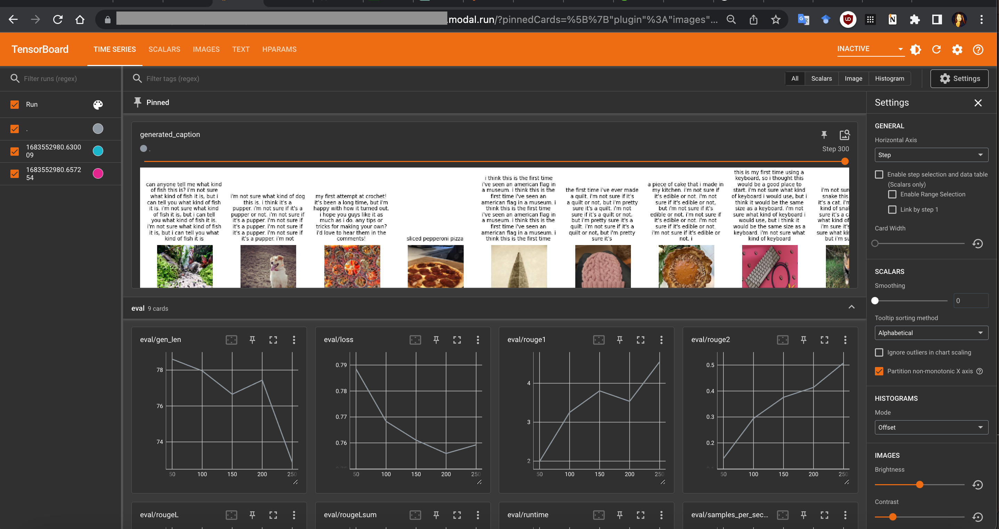
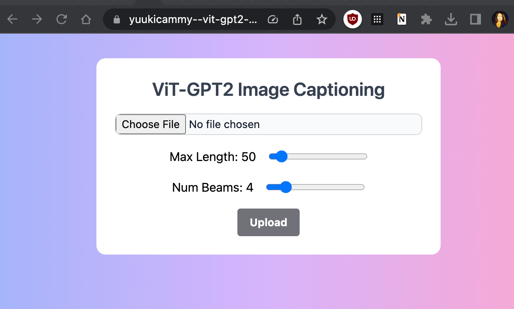

# Image captioning with ViT and GPT-2 from learning to demonstration on Modal

## About
This repository provides programs to (1) fine-tune a model for image captioning with ViT and GPT2 and (2) demonstrate  image captioning with the learned models.

## What is Modal
[Modal](https://modal.com/ ) builds amazing infrastructure for data/ML apps in the cloud.
You can build and use microservices in the cloud as if you were writing and executing Python code locally.
I was amazed at the ease of use and design of this new service. I like Modal. 

To run this program, please register an account with [Modal](https://modal.com/ ) .


## ViT-GPT-2 Image Captioning

- Base model: [nlpconnect/vit-gpt2-image-captioning](https://huggingface.co/nlpconnect/vit-gpt2-image-captioning )

- Dataset for fine-tuning: 
   - [COCO](https://cocodataset.org/#home ) (Recommended)
   - [RedCaps](https://huggingface.co/datasets/red_caps )

## How to use

### (0) Set the dataset on SharedVolume for fine-tuning

#### COCO (Recommended)

Download coco dataset from the official repositores to a shared volume on Modal.   
The name of the shared volume is specified in `model_training/config.py` (default: `image-caption-vol`).
```shell
$ modal run model_training/download_coco_dataset.py
```   

Check the shared volume.
```shell
$ modal volume ls image-caption-vol /coco

Directory listing of 'coco' in 'image-caption-vol'
┏━━━━━━━━━━━━━━━━━━━━━━━━━━━━━━┳━━━━━━┓
┃ filename                     ┃ type ┃
┡━━━━━━━━━━━━━━━━━━━━━━━━━━━━━━╇━━━━━━┩
│ train2017                    │ dir  │
│ annotations                  │ dir  │
│ val2017                      │ dir  │
└──────────────────────────────┴──────┘
```

#### RedCaps
1. Split the [RedCaps](https://huggingface.co/datasets/red_caps ) dataset into training, validation, and testing, then save them into SharedVolume and/or your Hugging Face repository.   
The name of the shared volume is specified in `model_training/config.py` (default: `image-caption-vol`).

```shell
$ modal run model_training/split_dataset.py --save-dir=red_caps --push-hub-rep=[YOUR-HF-ACCOUNT]/red_caps
```   
Check the shared volume.   
```shell
$ modal volume ls image-caption-vol /red_caps

Directory listing of '/red_caps' in 'image-caption-vol'
┏━━━━━━━━━━━━━━━━━━━┳━━━━━━┓
┃ filename          ┃ type ┃
┡━━━━━━━━━━━━━━━━━━━╇━━━━━━┩
│ test              │ dir  │
│ train             │ dir  │
│ dataset_dict.json │ file │
│ val               │ dir  │
└───────────────────┴──────┘
```

2. Build a subset of the dataset the shared volume on Modal.

```shell
$ modal run model_training/build_dataset_subset.py --from-dataset-path=red_caps \ --to-dataset-path=red-caps-5k-01 --num-train=3500 --num-val=500 --num-test=1000
```   

### (1) Fine-tuning

1. Start the training on Modal.   
The default stab name is `vit-gpt2-image-caption-train`. Machine usage (e.g. GPU memory in use) is available at https://modal.com/apps.
```shell
$ modal run model_training/train.py 
```

2. Check the learning status with TensorBoard
```shell
$ modal deploy model_training/tfboard_webapp.py 
```
Access the URL displayed as "Created tensorboard_app => https://XXXXXX.modal.run" to open the TensorBoard.
<p align="center">
</br>
TensorBoard screen
</p>

### (2) Demonstration

1. Deploy the web endpoints for the demo.
```shell
$ modal deploy demo/vit_gpt2_image_caption.py
$ modal deploy demo/vit_gpt2_image_caption_webapp.py 
```

2. Open the website and try the demo.

"Created wrapper => https://[YOUR_ACCOUNT]--vit-gpt2-image-caption-webapp-wrapper.modal.run"

<p align="center">
</br>
Demo website screen
</p>

[My demo website is here.](https://yuukicammy--vit-gpt2-image-caption-webapp-wrapper.modal.run/)


